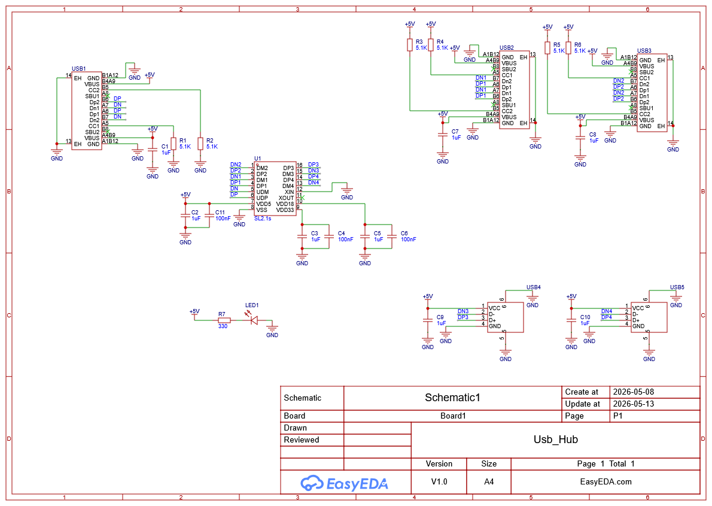
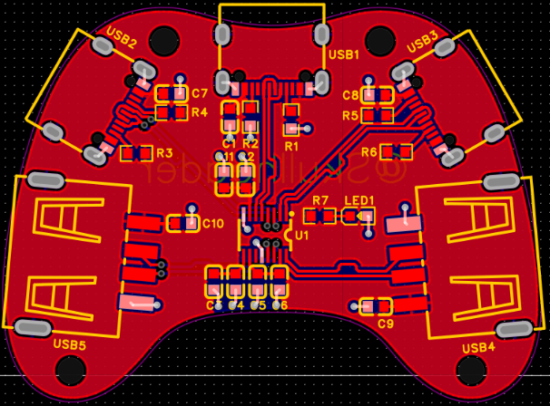
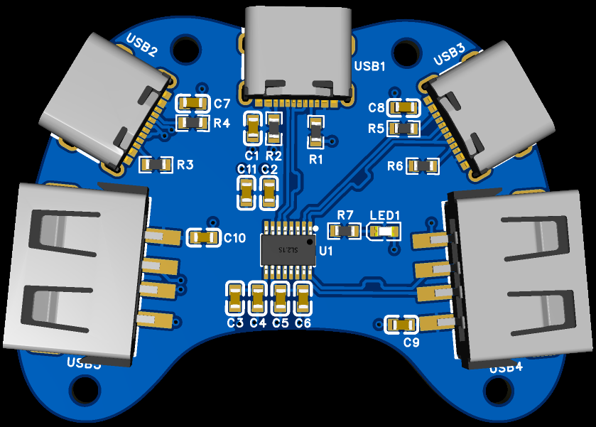
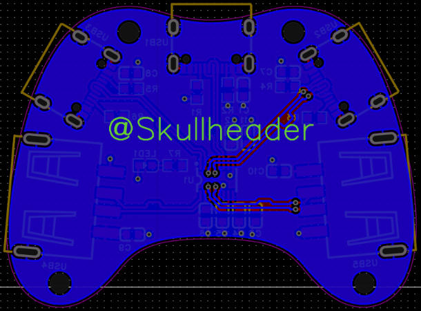
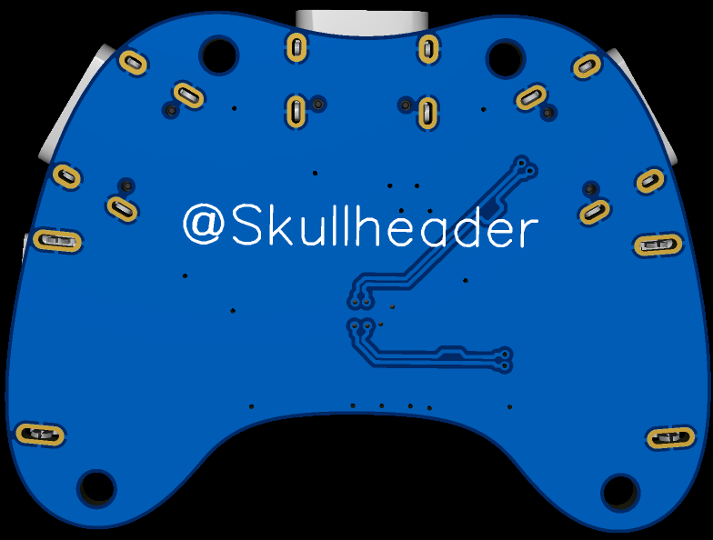
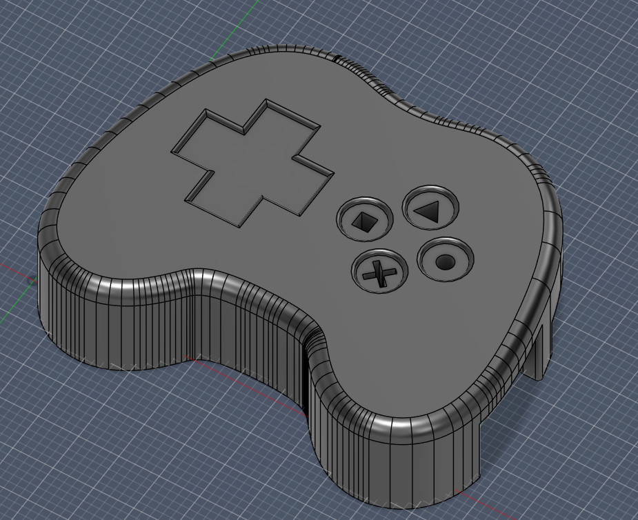
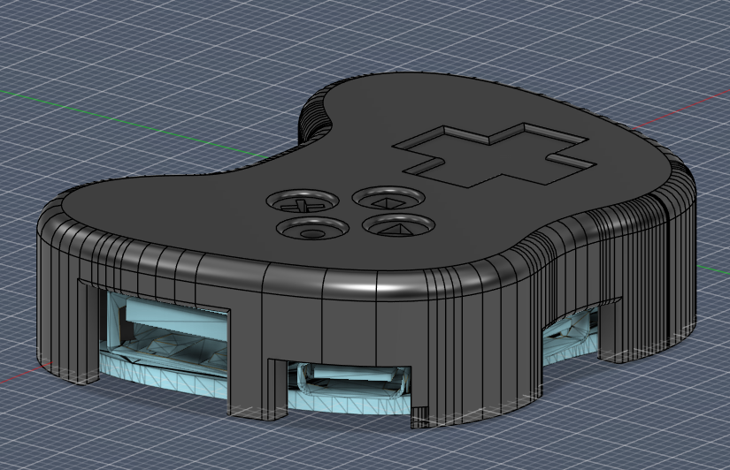
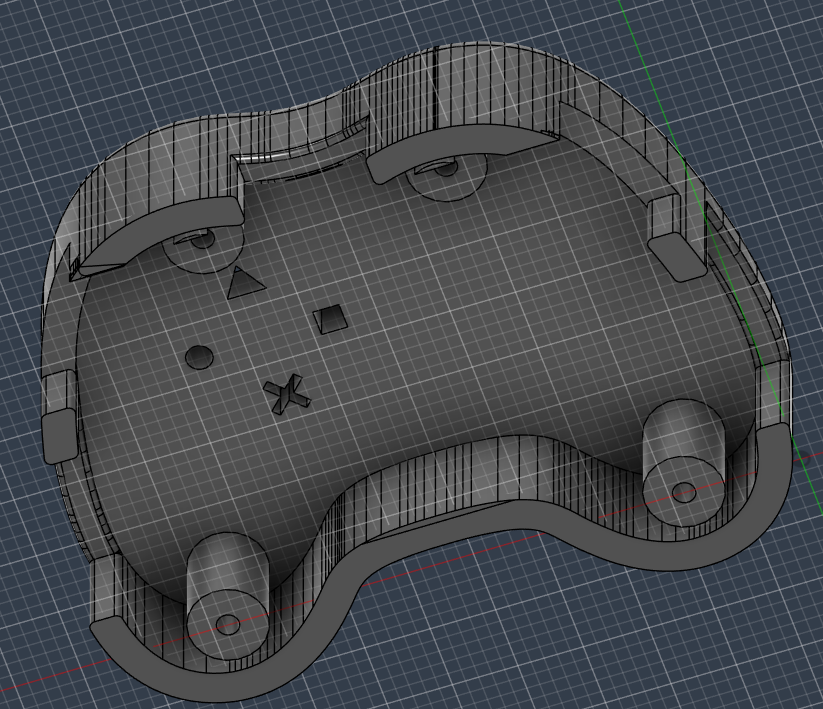

# USB-Hub

## About the project

The USB-Hub provides the functionality to divide a USB-C upstream into 2 USB-C downstream and 2 USB-A downstream ports.

## Features

- 2 USB-A ports
- 2 USB-C ports
- Indicator light to signal whether the USB hub is currently plugged in

## Repository Structure

- `images/` - contains images used in README
- `production/pcb/` - contains PCB production files
- `production/cad/` - contains 3D printing files

## Schematic

## PCB

## 3D-Casing

## Bill of Materials

| ID | Name | Designator | Footprint | Quantity | Manufacturer Part | Manufacturer | Supplier | Supplier Part | Price | Pins |
|---:|---|---|---|---:|---|---|---|---|---:|---:|
| 1 | 1µF | C1,C2,C3,C5,C7,C8,C9,C10 | C0603 | 8 | CL10A105KB8NNNC | SAMSUNG(三星) | LCSC | C15849 | 0.0076 | 2 |
| 2 | 100nF | C4,C6,C11 | C0603 | 3 | CC0603KRX7R9BB104 | YAGEO(国巨) | LCSC | C14663 | 0.0031 | 2 |
| 3 | KT-0603YG | LED1 | LED0603-RD | 1 | KT-0603YG | KENTO | LCSC | C2289 | 0.0110 | 2 |
| 4 | 5.1kΩ | R1,R2,R3,R4,R5,R6 | R0603 | 6 | 0603WAF5101T5E | UNIROYAL ELEC(厚声) | LCSC | C23186 | 0.0016 | 2 |
| 5 | 330Ω | R7 | R0603 | 1 | 0603WAF3300T5E | UNIROYAL ELEC(厚声) | LCSC | C23138 | 0.0016 | 2 |
| 6 | SL2.1s | U1 | SSOP-16_L4.6-W2.6-P0.53-LS4.0-BL | 1 | SL2.1s | CoreChips(和芯润德) | LCSC | C2684433 | 0.2258 | 16 |
| 7 | TYPE-C 16PIN 2MD(073) | USB1,USB2,USB3 | USB-C-SMD_TYPE-C-16PIN-2MD-073 | 3 | TYPE-C 16PIN 2MD(073) | SHOU HAN(首韩) | LCSC | C2765186 | 0.0664 | 16 |
| 8 | 10.0QHHTZB6.3 | USB4,USB5 | USB-A-TH_10.0QHHTZB6.3 | 2 | 10.0 QHHTZB6.3 | SHOU HAN(首韩) | LCSC | C668591 | 0.0666 | 6 |

## License

This project is licensed under the MIT License.

## Credits

- [EasyEDA](https://easyeda.com) - Schematic & PCB design
- [Fusion 360](https://www.autodesk.com/products/fusion-360) - 3D casing design
- [@NotARoomba](https://github.com/NotARoomba) - README template
